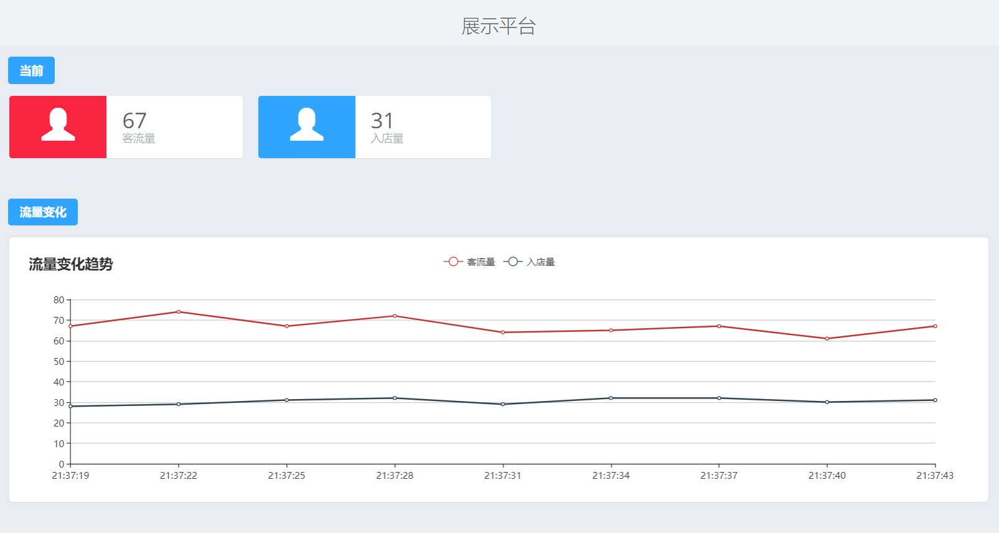

# WifiProbe-Demo
WIFI探针，可以获取周围手机信号距离等数据，做了一个可以接收数据，存储数据，展示数据的小Demo。

## 运行环境
- 支持平台：apache-tomcat-8.0.37
- 开发语言：java
- 数据库：mysql
- 开发工具：eclipse

## 概览

### 设计功能：
1. 接收数据
2. 处理Json数据
3. 数据库存数据
3. 展示数据

### 效果图:

### 相关技术
- 简单的JSP开发
- Serlvet编写
- 无框架的数据库操作
- SQL查询语言的编写
- echarts数据图表展示传过来的数据

### 代码目录
- `/src/` 后台工作目录

   `/src/com/controller/` 控制器代码目录

    `/src/com/db/` 数据库访问代码目录

- `/WebContent/` 前端目录
  `/WebContent/index.jsp` 页面
	
### 数据表
简化了之后格式：[ time, mac, rssi, rangedis, proID, mmac ]

## Wifi探针数据示例
{
        "id":   "0010f377",    //嗅探器设备id  
        "mmac": "5e:cf:7f:10:f3:77", //嗅探器设备自身WiFi mac   
        "rate": "1", //发送频率  
        "wssid":  "kaituo", //嗅探器设备连接的WIFI的ssid  
        "wmac": "a8:57:4e:c0:d4:8c", //嗅探器设备连接的WIFI的mac地址  
        "time": "Sat Jun 04 22:45:28 2016",//时间戳，采集到这些mac的时间  
        "lat":    "30.748093",  //北半球，纬度  
        "lon":    "103.973083",        //经度  
        "addr":    "江苏省南京市玄武大道699-22号", //地址信息  
        "data": [{  
                        "mac":  "9a:21:6a:7b:62:6a", //采集到的手机mac地址  
                        "rssi": "-30",//rssi，手机的信号强度，如rssi=-75dbm  
						"range": "1.0",//手机距离嗅探器的测距距离字段，单位米  
                        "ts":   "hello", //目标ssid，手机连接的WIFI的ssid  
                        "tmc":  "00:01:02:03:04:05", //目标设备的mac地址，手机连接的WIFI的mac地址  
                        "tc":   "Y", //是否与路由器相连  
                        "ds":   "N",//手机是否睡眠  
                        "essid0":  "七天连锁_wifi"//手机用户9a:21:6a:7b:62:6a曾经连接过的WIFI的SSID  
                        "essid1"："工商银行"//手机用户9a:21:6a:7b:62:6a曾经连接过的WIFI的SSID  
                        "essid2":"东方明珠",  
                        "essid3":"home"，  
              		    "essid4":"abcd",  
              		    "essid5":"xiong",  
             			"essid6":"XX会馆"  
                  },   
				  {  
                        "mac":  "1c:31:72:5c:83:6b",  
                        "rssi": "-69"，  
                        "range": "14.0"，  
                        "ts":   "world",  
                        "tmc":  "00:01:02:03:04:06",  
                        "tc":   "Y",  
                        "ds":   "Y",  
                		"essid0":  "七天连锁_wifi"//手机用户9a:21:6a:7b:62:6a曾经连接过的WIFI的SSID  
                		"essid1"："工商银行"//手机用户9a:21:6a:7b:62:6a曾经连接过的WIFI的SSID  
                  }  
				]  
}  

## Authors
qiwenkaikai@qq.com
